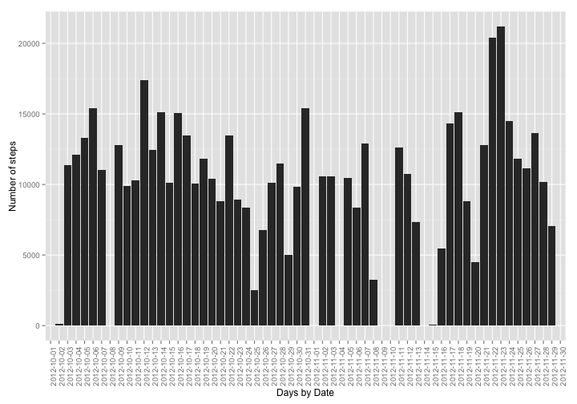
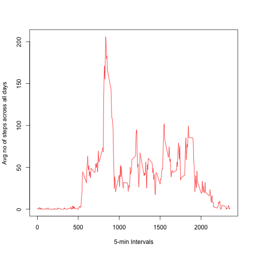
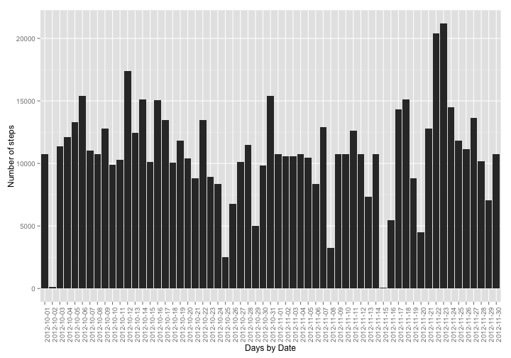
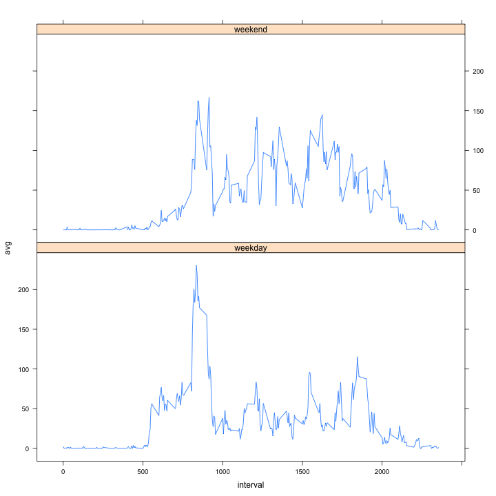

# Reproducible Research: Peer Assessment 1
This assignment makes use of data from a personal activity monitoring device. This device collects data at 5 minute intervals through out the day. The data consists of two months of data from an anonymous individual collected during the months of October and November, 2012 and include the number of steps taken in 5 minute intervals each day.

## Loading and preprocessing the data
The input dataset is present in the current directory in zipped fmt (as mentioned in the assignment)

```r
unzip("activity.zip")
dat = read.csv("activity.csv")
```

## What is mean total number of steps taken per day?
We ignore the missing values in the dataset here.

```r
library(ggplot2)
agg <- aggregate(dat$steps, by = list(dat$date), FUN = sum, na.rm=T)
names(agg) <- c("date","sum")
ggplot(agg, aes(date, sum)) + geom_histogram(stat="identity") + 
    theme(axis.text.x = element_text(angle = 90, hjust = 1))+ xlab("Days by Date") + ylab("Number of steps")
```

 

```r
print(paste0("Mean total number of steps taken per day:",mean(agg$sum)))
```

```
## [1] "Mean total number of steps taken per day:9354.22950819672"
```

```r
print(paste0("Median total number of steps taken per day:",median(agg$sum)))
```

```
## [1] "Median total number of steps taken per day:10395"
```

## What is the average daily activity pattern?

```r
avg_daily_activity <- aggregate(dat$steps,by=list(dat$interval), FUN=mean,na.rm=T)
names(avg_daily_activity) <- c("interval","avg")
plot(avg_daily_activity$interval,avg_daily_activity$avg,type="l",col="red",xlab="5-min Intervals",ylab="Avg no of steps across all days")
```

 

```r
max_avg <- max(avg_daily_activity$avg)
max_interval <- avg_daily_activity[as.numeric(avg_daily_activity$avg)==as.numeric(max_avg),"interval"]
print(paste0("The 5-minute interval, on average across all the days in the dataset, that contains the maximum number of steps: ", max_interval))
```

```
## [1] "The 5-minute interval, on average across all the days in the dataset, that contains the maximum number of steps: 835"
```

## Imputing missing values
Our strategy for filling in all of the missing values in the dataset, will be the mean for that 5-minute interval across all days as computed by avg_daily_activity above


```r
print(paste0("Total number of missing values in the dataset (i.e. the total number of rows with NAs): ", sum(is.na(dat$steps))))
```

```
## [1] "Total number of missing values in the dataset (i.e. the total number of rows with NAs): 2304"
```

```r
datnoNA <- dat
n <- length(datnoNA$steps)
for (i in 1:n){
    if (is.na(datnoNA$steps[i])) {
        datnoNA$steps[i] <- as.numeric(avg_daily_activity[avg_daily_activity$interval==datnoNA$interval[i],"avg"])
    }
}
aggnoNA <- aggregate(datnoNA$steps, by = list(datnoNA$date), FUN = sum, nan.rm=T)
names(aggnoNA) <- c("date","sum")
ggplot(aggnoNA, aes(date, sum)) + geom_histogram(stat="identity") + 
    theme(axis.text.x = element_text(angle = 90, hjust = 1))+ xlab("Days by Date") + ylab("Number of steps")
```

 

```r
print(paste0("Mean total number of steps taken per day:",mean(aggnoNA$sum)))
```

```
## [1] "Mean total number of steps taken per day:10767.1886792453"
```

```r
print(paste0("Median total number of steps taken per day:",median(aggnoNA$sum)))
```

```
## [1] "Median total number of steps taken per day:10767.1886792453"
```

```r
print("The overall impact of imputing missing data on the estimates of the total daily number of steps is a slight increase in the mean as well as median of the total number of steps taken per day. We now have more datapoints to give better estimates and so the mean and median are closer or same.")
```

```
## [1] "The overall impact of imputing missing data on the estimates of the total daily number of steps is a slight increase in the mean as well as median of the total number of steps taken per day. We now have more datapoints to give better estimates and so the mean and median are closer or same."
```


## Are there differences in activity patterns between weekdays and weekends?
We use filled-in missing values for the below.

```r
wkd <- sapply(datnoNA$date,function(x){w <- weekdays(as.Date(x)); if( w != as.character("Sunday") && w != as.character("Saturday")) "weekday" else "weekend"})
datnoNAwkd <- cbind(datnoNA,wkd)
datanoNAby5intervalwkd<- aggregate(datnoNAwkd$steps,by=list(datnoNAwkd$interval,datnoNAwkd$wkd), FUN=mean,na.rm=T)
names(datanoNAby5intervalwkd) <- c("interval","day","avg")
library(lattice)
xyplot(avg~interval | day, data=datanoNAby5intervalwkd,type="l",layout = c(1, 2))
```

 
